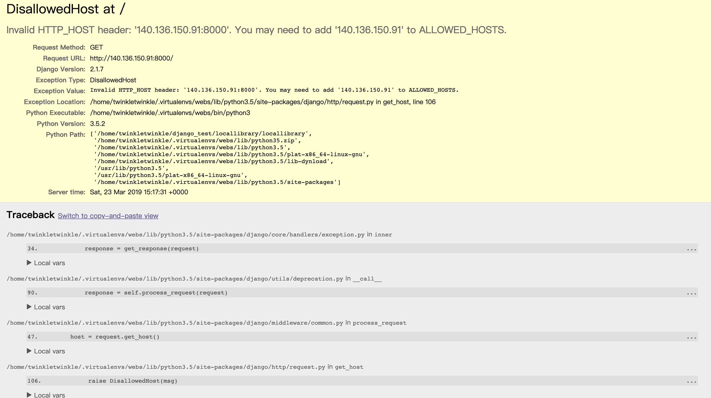
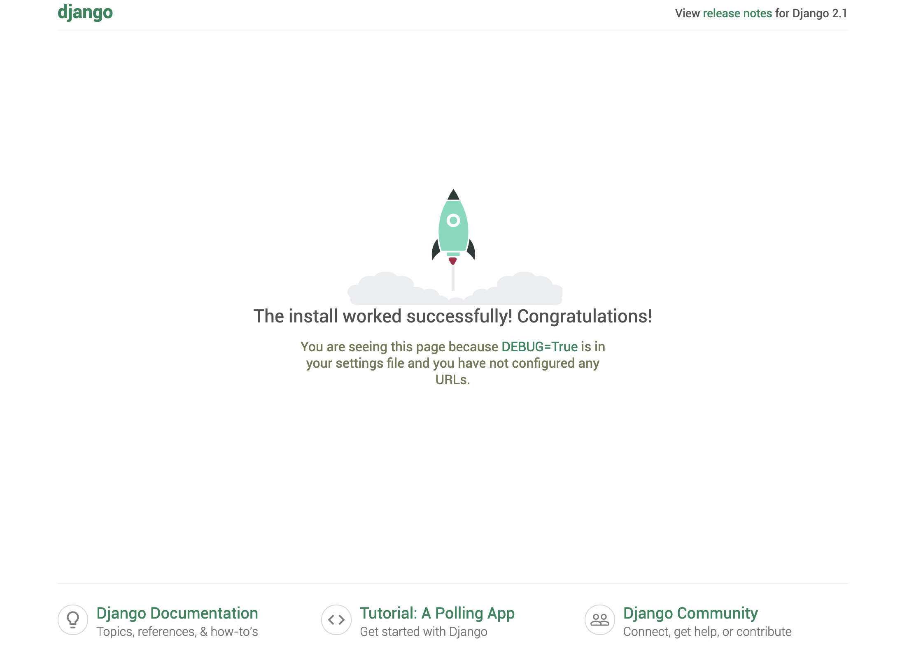

## 網頁架設記錄 - 第一次使用 Django - 其一

----

- 安裝 django 之前，我使用了 Python 虛擬環境來使用 Django，理由是因為這一台機器還有我的其他夥伴組員也要使用，如果我直接裝到機器上的時候可能會發生像以前一樣的衝突發生，我也擔心因為大家的東西打在一起會出現不知道怎麼處理的 bug。

### Instrumental Detail
- 使用的機器為 Mac Pro至於爲什麼是 Mac Pro 原因是因為有一台機器丟在那裡沒有人用，所以我就拿來用了。
- OS 為 ubuntu 16.04，裡面的系統原本是 Windows 7，MacOS 不見了，所以就用方便安裝的。
- 現在使用的 Python 的版本是 3.5.1 ，這個版本有點舊，但是好像沒有辦法更新了。

----

###安裝 virtualenv

- 安裝虛擬環境的指令是```pip3 install virtualenvwrapper``` ，然後還要加以下幾行到 ```.bashrc``` 下面···

  ```bash
  export WORKON_HOME=$HOME/.virtualenvs
  export VIRTUALENVWRAPPER_PYTHON=/usr/bin/python3
  export VIRTUALENVWRAPPER_VIRTUALENV_ARGS=' -p /usr/bin/python3 '
  export PROJECT_HOME=$HOME/Devel
  source /usr/local/bin/virtualenvwrapper.sh
  ```
  - 設定應該就是進入 ```workon``` 的時候會把一些環境自動設定虛擬的home、python3。
  - 存好檔案之後 ```source ~/.bashrc``` 就好了

----

### 安裝 Django

- ```pip3 install django```，輕輕鬆鬆

- 創一個 mytestsite 作為測試

- ```bash
  django-admin startproject mytestsite
  cd mytestsite
  ```

- 然後可以 run 看看 server，使用以下指令

- ```bash
  python3 manage.py runserver 
  ```

  - 然後就會跑出一些執行的訊息，上面寫說用網頁瀏覽器開啟```localhost:8000```可以看到建好的網頁。

- 但是因為我是用 ssh 控制 server，所以我比需要開放外連，所以要把 runserver改成

- ```bash
  python3 manage.py runserver 0.0.0.0:8000
  ```

- 弄好之後會看到類似這樣的東西
  

  原因是因為忘記開 allowhost 了，開法就是修改裡面有一個 setting.py 的檔案，檔案位置就在 manage.py 旁邊的資料夾裡面，裡面有一行就是有關 Allowhost 的 list，改為 ```ALLOWED_HOSTS = ['*',]```，這樣就可以外連了


- 完成

  

----

### 以下為使用到的參考資料以及教學

- https://developer.mozilla.org/zh-TW/docs/Learn/Server-side/Django/development_environment
- http://richohan.github.io/virtualenvwrapper-an-zhuang-yu-shi-yong.html
- https://blog.csdn.net/luojie140/article/details/76708797